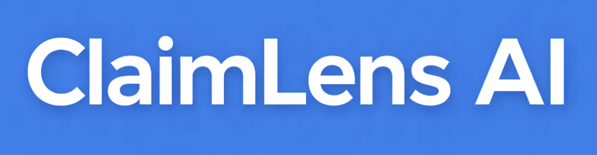

<div align="center">

<p align="center">
  
</p>


**AI-Powered Insurance Claim Analysis Platform**

[](https://www.python.org/)
[](https://fastapi.tiangolo.com/)
[](https://reactjs.org/)
[](https://www.postgresql.org/)
[](https://www.docker.com/)
[](https://aws.amazon.com/bedrock/)

[Features](#-features) • [Architecture](#-architecture) • [Quick Start](#-quick-start) • [Documentation](#-documentation) • [API Reference](#-api-reference)

</div>

---

## Table of Contents

- [Overview](#-overview)
- [Features](#-features)
- [Architecture](#-architecture)
- [Technology Stack](#-technology-stack)
- [Quick Start](#-quick-start)
- [Installation](#-installation)
- [Configuration](#-configuration)
- [API Reference](#-api-reference)
- [RAG Pipeline](#-rag-pipeline)
- [LLM Integration](#-llm-integration)
- [Deployment](#-deployment)
- [Development](#-development)
- [Testing](#-testing)
- [Contributing](#-contributing)
- [License](#-license)

---

## Overview

**ClaimLens AI** is an intelligent insurance claim analysis platform that leverages Retrieval-Augmented Generation (RAG) and Large Language Models (LLMs) to automate the evaluation of health insurance claims against policy documents. The system extracts relevant policy clauses, analyzes claim compliance, and provides actionable recommendations for claim adjudicators.

### Key Capabilities

- **Automated Document Processing**: Extract and parse policy documents (PDF) with OCR support
- **Intelligent Clause Retrieval**: Semantic search using vector embeddings to find relevant policy clauses
- **AI-Powered Analysis**: LLM-based reasoning for compliance assessment and risk identification
- **Real-time Recommendations**: Actionable insights for claim approval/denial decisions
- **Multi-Tenant Support**: Role-based access control for different user types

---

## Features

### Core Features

| Feature | Description |
|---------|-------------|
| **Document Ingestion** | Upload and process insurance policy PDFs with automatic text extraction |
| **Semantic Search** | Find relevant policy clauses using advanced embedding models |
| **AI Analysis** | Comprehensive claim analysis using Claude/GPT models |
| **Risk Assessment** | Identify compliance risks with severity ratings |
| **Recommendations** | Get actionable suggestions for claim processing |
| **Analytics Dashboard** | Visual insights into claim patterns and outcomes |

### AI/ML Features

| Feature | Description |
|---------|-------------|
| **RAG Pipeline** | Retrieval-Augmented Generation for context-aware responses |
| **Embeddings** | Multiple embedding options (HuggingFace BGE, Amazon Titan) |
| **Vector Store** | FAISS (local) and pgvector (production) for similarity search |
| **Reranking** | Cross-encoder reranking for improved retrieval accuracy |
| **Caching** | Redis-based caching for faster repeated queries |

---

## Architecture

```
┌─────────────────────────────────────────────────────────────────────┐
│                           ClaimLens AI                              │
├─────────────────────────────────────────────────────────────────────┤
│                                                                     │
│  ┌─────────────┐    ┌─────────────┐    ┌─────────────────────────┐  │
│  │   Frontend  │    │   Backend   │    │     AI/ML Pipeline      │  │
│  │   (React)   │◄──►│  (FastAPI)  │◄──►│  (RAG + LLM)            │  │
│  └─────────────┘    └──────┬──────┘    └───────────┬─────────────┘  │
│                            │                       │                │
│                            ▼                       ▼                │
│  ┌─────────────────────────────────────────────────────────────┐    │
│  │                     Data Layer                              │    │
│  │  ┌──────────┐  ┌──────────┐  ┌──────────┐  ┌───────────┐    │    │
│  │  │PostgreSQL│  │  Redis   │  │  FAISS/  │  │    S3     │    │    │
│  │  │(pgvector)│  │ (Cache)  │  │ pgvector │  │(Documents)│    │    │
│  │  └──────────┘  └──────────┘  └──────────┘  └───────────┘    │    │
│  └─────────────────────────────────────────────────────────────┘    │
│                                                                     │
│  ┌─────────────────────────────────────────────────────────────┐    │
│  │                        LLM Providers                        │    │
│  │       ┌──────────┐  ┌──────────┐  ┌──────────┐              │    │
│  │       │   Mock   │  │  Ollama  │  │  AWS     │              │    │
│  │       │  (Dev)   │  │ (Local)  │  │ Bedrock  │              │    │
│  │       └──────────┘  └──────────┘  └──────────┘              │    │
│  └─────────────────────────────────────────────────────────────┘    │
│                                                                     │
└─────────────────────────────────────────────────────────────────────┘
```

### Component Overview

| Component | Technology | Purpose |
|-----------|------------|---------|
| **Frontend** | React 18 + TailwindCSS | User interface for claim management |
| **Backend API** | FastAPI + Python 3.11 | REST API and business logic |
| **Database** | PostgreSQL 16 + pgvector | Persistent storage with vector search |
| **Cache** | Redis 7 | Session management and query caching |
| **Vector Store** | FAISS / pgvector | Semantic similarity search |
| **Object Storage** | AWS S3 / LocalStack | Document and file storage |
| **LLM** | AWS Bedrock / Ollama | Language model inference |

---

## Technology Stack

### Backend

| Technology | Version | Purpose |
|------------|---------|---------|
| **Python** | 3.11+ | Core programming language |
| **FastAPI** | 0.109+ | High-performance async web framework |
| **Uvicorn** | 0.27+ | ASGI server with HTTP/2 support |
| **SQLAlchemy** | 2.0+ | Async ORM for database operations |
| **Alembic** | 1.13+ | Database migration management |
| **Pydantic** | 2.5+ | Data validation and serialization |
| **asyncpg** | 0.29+ | Async PostgreSQL driver |

### AI/ML Stack

| Technology | Version | Purpose |
|------------|---------|---------|
| **LangChain** | 0.1+ | LLM orchestration framework |
| **Sentence Transformers** | 2.2+ | Text embedding models |
| **FAISS** | 1.7+ | Vector similarity search (local) |
| **pgvector** | 0.2+ | Vector similarity search (production) |
| **PyTorch** | 2.0+ | Deep learning framework |
| **Transformers** | 4.36+ | HuggingFace model library |
| **HuggingFace Hub** | 0.20+ | Model repository access |

### Frontend

| Technology | Version | Purpose |
|------------|---------|---------|
| **React** | 18.2 | UI component library |
| **React Router** | 6.21+ | Client-side routing |
| **TailwindCSS** | 3.4+ | Utility-first CSS framework |
| **Axios** | 1.6+ | HTTP client |
| **Recharts** | 2.10+ | Data visualization |
| **Lucide React** | 0.312+ | Icon library |
| **React Dropzone** | 14.2+ | File upload component |

### Infrastructure

| Technology | Version | Purpose |
|------------|---------|---------|
| **Docker** | 24+ | Containerization |
| **Docker Compose** | 2.24+ | Multi-container orchestration |
| **PostgreSQL** | 16 | Primary database with pgvector |
| **Redis** | 7.2+ | Caching and session storage |
| **Nginx** | 1.25+ | Reverse proxy and static files |
| **LocalStack** | Latest | AWS service emulation (S3) |

### AWS Services (Production)

| Service | Purpose |
|---------|---------|
| **AWS Bedrock** | Claude/Titan LLM inference |
| **Amazon S3** | Document storage |
| **Amazon Titan** | Text embeddings |
| **AWS CloudFormation** | Infrastructure as Code |

### Document Processing

| Library | Purpose |
|---------|---------|
| **PyMuPDF** | PDF parsing and text extraction |
| **pdfplumber** | Advanced PDF table extraction |
| **pypdf** | PDF manipulation |
| **Tesseract OCR** | Optical character recognition |
| **Pillow** | Image processing |

### Security & Auth

| Technology | Purpose |
|------------|---------|
| **python-jose** | JWT token handling |
| **passlib + bcrypt** | Password hashing |
| **CORS Middleware** | Cross-origin request handling |

### Monitoring & Logging

| Technology | Purpose |
|------------|---------|
| **OpenTelemetry** | Distributed tracing |
| **python-json-logger** | Structured JSON logging |

---

## Quick Start

### Prerequisites

- Docker Desktop 24+ with Docker Compose
- Git
- 8GB+ RAM recommended
- 20GB+ disk space (for ML models)

### 1. Clone the Repository

```bash
git clone https://github.com/your-org/ClaimLens-AI4Bharat.git
cd ClaimLens-AI4Bharat
```

### 2. Configure Environment

```bash
# Edit configuration (optional - defaults work for local development)
nano .env.sample
```

### 3. Start the Application

```bash
# Local development (with mock LLM)
docker compose --profile local up -d

# Or with Ollama for local AI
docker compose --profile local --profile ollama up -d
```

### 4. Build Vector Index (First Time)

```bash
# Build FAISS index from policy documents
docker compose exec backend python scripts/build_faiss_index.py
```

### 5. Access the Application

| Service | URL |
|---------|-----|
| **Frontend** | http://localhost:3000 |
| **Backend API** | http://localhost:8000 |
| **API Documentation** | http://localhost:8000/docs |
| **Health Check** | http://localhost:8000/health |

### Default Credentials

```
Email: admin@claimlens.com
Password: admin123
```

---

## Installation

### Local Development Setup

```bash
# 1. Clone repository
git clone https://github.com/your-org/ClaimLens-AI4Bharat.git
cd ClaimLens-AI4Bharat

# 2. Configure environment (optional - defaults work for local)
nano .env.sample

# 3. Start services
docker compose --profile local up -d

# 4. Wait for services to be healthy
docker compose ps

# 5. Initialize database (automatic on first start)
docker compose exec backend alembic upgrade head

# 6. Build FAISS index
docker compose exec backend python scripts/build_faiss_index.py
```

### Production Deployment

```bash
# 1. Configure production environment
# Edit .env.sample with production values:
# - Set ENVIRONMENT=production
# - Configure AWS credentials
# - Set strong passwords and secrets
nano .env.sample

# 2. Build and deploy
docker compose --profile prod up -d --build

# 3. Run migrations
docker compose exec backend alembic upgrade head
```

---

## Configuration

### Environment Variables

| Variable | Default | Description |
|----------|---------|-------------|
| `ENVIRONMENT` | `local` | Environment (local/production) |
| `DEBUG` | `true` | Enable debug mode |
| `SECRET_KEY` | (generated) | JWT signing key |
| `DATABASE_URL` | (docker default) | PostgreSQL connection string |
| `REDIS_URL` | (docker default) | Redis connection string |

### LLM Configuration

| Variable | Default | Description |
|----------|---------|-------------|
| `LLM_MODE` | `mock` | LLM mode (mock/ollama/bedrock) |
| `USE_MOCK_LLM` | `true` | Use mock responses |
| `BEDROCK_ENABLED` | `false` | Enable AWS Bedrock |
| `BEDROCK_MODEL_ID` | `anthropic.claude-3-sonnet` | Bedrock model ID |
| `OLLAMA_HOST` | `http://ollama:11434` | Ollama server URL |
| `OLLAMA_MODEL` | `llama3.2` | Ollama model name |

### Embedding Configuration

| Variable | Default | Description |
|----------|---------|-------------|
| `EMBEDDING_MODE` | `local` | Embedding mode (mock/local/bedrock) |
| `EMBEDDING_MODEL` | `BAAI/bge-base-en-v1.5` | HuggingFace model name |
| `VECTOR_STORE_TYPE` | `faiss` | Vector store (faiss/pgvector) |

### AWS Configuration (Production)

| Variable | Description |
|----------|-------------|
| `AWS_REGION` | AWS region |
| `AWS_ACCESS_KEY_ID` | AWS access key |
| `AWS_SECRET_ACCESS_KEY` | AWS secret key |
| `S3_BUCKET_NAME` | S3 bucket for documents |

---

## API Reference

### Authentication

```bash
# Register new user
POST /api/v1/auth/register
{
  "email": "user@example.com",
  "password": "secure_password",
  "full_name": "John Doe"
}

# Login
POST /api/v1/auth/login
{
  "email": "user@example.com",
  "password": "secure_password"
}
```

### Claims Management

```bash
# Create claim
POST /api/v1/claims/
{
  "claim_number": "CLM-2024-001",
  "policy_number": "POL-123456",
  "claim_amount": 50000,
  "claim_type": "hospitalization",
  "description": "Surgery for appendicitis"
}

# Get claim
GET /api/v1/claims/{claim_id}

# List claims
GET /api/v1/claims/?status=pending&page=1&limit=10
```

### Analysis

```bash
# Analyze claim against policy
POST /api/v1/analysis/analyze
{
  "claim_id": "uuid-here",
  "policy_documents": ["policy-doc-id"],
  "analysis_type": "comprehensive"
}

# Get analysis results
GET /api/v1/analysis/claim/{claim_id}
```

### Documents

```bash
# Upload document
POST /api/v1/documents/upload
Content-Type: multipart/form-data
file: <PDF file>

# Get document
GET /api/v1/documents/{document_id}

# Search policy clauses
POST /api/v1/policies/search
{
  "query": "room rent coverage limit",
  "top_k": 5
}
```

### Full API Documentation

Interactive API documentation is available at:
- **Swagger UI**: http://localhost:8000/docs
- **ReDoc**: http://localhost:8000/redoc

---

## RAG Pipeline

### Overview

The Retrieval-Augmented Generation (RAG) pipeline enhances LLM responses by retrieving relevant context from policy documents.

```
┌──────────────┐    ┌──────────────┐    ┌──────────────┐    ┌──────────────┐
│    Query     │───►│  Embedding   │───►│   Vector     │───►│  Retrieved   │
│              │    │   Model      │    │   Search     │    │   Clauses    │
└──────────────┘    └──────────────┘    └──────────────┘    └──────────────┘
                                                                    │
                                                                    ▼
┌──────────────┐    ┌──────────────┐    ┌──────────────┐    ┌──────────────┐
│   Response   │◄───│     LLM      │◄───│   Prompt     │◄───│  Reranked    │
│              │    │   (Claude)   │    │   Builder    │    │   Results    │
└──────────────┘    └──────────────┘    └──────────────┘    └──────────────┘
```

### Pipeline Components

| Component | Local | Production |
|-----------|-------|------------|
| **Embeddings** | HuggingFace BGE | Amazon Titan |
| **Vector Store** | FAISS | pgvector |
| **Reranker** | Cross-Encoder | Cross-Encoder |
| **LLM** | Mock/Ollama | AWS Bedrock Claude |

### Indexing Process

```bash
# Build FAISS index from policy PDFs
docker compose exec backend python scripts/build_faiss_index.py

# Output:
# Processing: icici_complete_health.pdf
# Processing: niva_rise.pdf
# Indexed 238 clauses
# FAISS index saved to /app/data/faiss_index/
```

### Retrieval Configuration

```python
# Default retrieval settings
RETRIEVAL_TOP_K = 10          # Number of candidates to retrieve
RERANK_TOP_K = 5              # Number of results after reranking
SIMILARITY_THRESHOLD = 0.7    # Minimum similarity score
```

---

## LLM Integration

### Supported LLM Modes

| Mode | Use Case | Configuration |
|------|----------|---------------|
| **Mock** | UI development, testing | `LLM_MODE=mock` |
| **Ollama** | Local AI without cloud | `LLM_MODE=ollama` |
| **Bedrock** | Production deployment | `LLM_MODE=bedrock` |

### Mock Mode (Default)

Returns realistic predefined responses for development without any LLM costs.

```bash
# .env configuration
LLM_MODE=mock
USE_MOCK_LLM=true
```

### Ollama Mode (Local AI)

Run open-source models locally using Ollama.

```bash
# Start with Ollama profile
docker compose --profile local --profile ollama up -d

# Pull a model
docker compose exec ollama ollama pull llama3.2

# Configuration
LLM_MODE=ollama
OLLAMA_HOST=http://ollama:11434
OLLAMA_MODEL=llama3.2
```

**Recommended Ollama Models:**

| Model | Size | RAM Required | Speed |
|-------|------|--------------|-------|
| `llama3.2:1b` | 1.3GB | 4GB | Fast |
| `llama3.2:3b` | 2.0GB | 6GB | Balanced |
| `mistral:7b` | 4.1GB | 8GB | Quality |
| `mixtral:8x7b` | 26GB | 32GB | Best |

### AWS Bedrock Mode (Production)

Use AWS Bedrock for production-grade Claude inference.

```bash
# .env configuration
LLM_MODE=bedrock
BEDROCK_ENABLED=true
BEDROCK_MODEL_ID=anthropic.claude-3-sonnet-20240229-v1:0
AWS_REGION=us-east-1
AWS_ACCESS_KEY_ID=your-access-key
AWS_SECRET_ACCESS_KEY=your-secret-key
```

---

## Deployment

### Docker Compose Profiles

| Profile | Purpose | Command |
|---------|---------|---------|
| `local` | Local development | `docker compose --profile local up -d` |
| `prod` | Production deployment | `docker compose --profile prod up -d` |
| `ollama` | Add Ollama LLM | `docker compose --profile local --profile ollama up -d` |

### Image Sizes

| Image | Local | Production |
|-------|-------|------------|
| Backend | 2.06 GB | 720 MB |
| Frontend | 836 MB | 836 MB |

### Production Checklist

- [ ] Set `ENVIRONMENT=production`
- [ ] Configure strong `SECRET_KEY`
- [ ] Set secure database password
- [ ] Configure AWS credentials
- [ ] Enable HTTPS/TLS
- [ ] Set up monitoring
- [ ] Configure backups
- [ ] Review security settings

### AWS Deployment

See [`docs/DEPLOYMENT_GUIDE.md`](docs/DEPLOYMENT_GUIDE.md) for detailed AWS deployment instructions using CloudFormation.

---

## Development

### Project Structure

```
ClaimLens-AI4Bharat/
├── backend/
│   ├── app/
│   │   ├── api/
│   │   │   └── v1/
│   │   │       └── endpoints/
│   │   ├── auth/
│   │   ├── core/
│   │   ├── db/
│   │   ├── ingestion/
│   │   ├── llm/
│   │   ├── rag/
│   │   ├── retriever/
│   │   ├── schemas/
│   │   ├── services/
│   │   └── utils/
│   ├── alembic/
│   ├── scripts/
│   └── tests/
├── frontend/
│   ├── src/
│   │   ├── api/
│   │   ├── components/
│   │   ├── context/
│   │   ├── hooks/
│   │   ├── pages/
│   │   └── utils/
│   └── public/
├── data/
├── docs/
├── aws/
├── docker-compose.yml
├── .env.sample
└── README.md
```

### Local Development Commands

```bash
# Start services
docker compose --profile local up -d

# View logs
docker compose logs -f backend

# Access backend shell
docker compose exec backend bash

# Run migrations
docker compose exec backend alembic upgrade head

# Create new migration
docker compose exec backend alembic revision --autogenerate -m "description"

# Rebuild specific service
docker compose up -d --build backend

# Stop services
docker compose down

# Stop and remove volumes
docker compose down -v
```

### Code Quality

```bash
# Format code (backend)
docker compose exec backend black .
docker compose exec backend isort .

# Type checking
docker compose exec backend mypy app/
```

---

## Testing

### Running Tests

```bash
# Run all backend tests
docker compose exec backend pytest

# Run with coverage
docker compose exec backend pytest --cov=app --cov-report=html

# Run specific test file
docker compose exec backend pytest tests/test_claims.py -v

# Run with verbose output
docker compose exec backend pytest -v -s
```

### Test Structure

```
backend/tests/
├── conftest.py          # Pytest fixtures
├── test_auth.py         # Authentication tests
├── test_claims.py       # Claims API tests
└── ...
```

---

## Documentation

| Document | Description |
|----------|-------------|
| [`README.md`](README.md) | This file - project overview |
| [`DOCKER.md`](DOCKER.md) | Docker setup and usage |
| [`docs/DEPLOYMENT_GUIDE.md`](docs/DEPLOYMENT_GUIDE.md) | Production deployment guide |
| [`docs/LLM_MODELS_GUIDE.md`](docs/LLM_MODELS_GUIDE.md) | LLM configuration guide |
| [`docs/design.md`](docs/design.md) | System design document |
| [`docs/documentation.md`](docs/documentation.md) | API documentation |
| [`backend/ReadMe.md`](backend/ReadMe.md) | Backend-specific docs |

---

## Contributing

1. Fork the repository
2. Create a feature branch (`git checkout -b feature/amazing-feature`)
3. Commit your changes (`git commit -m 'Add amazing feature'`)
4. Push to the branch (`git push origin feature/amazing-feature`)
5. Open a Pull Request

### Commit Convention

```
feat: Add new feature
fix: Bug fix
docs: Documentation update
style: Code style changes
refactor: Code refactoring
test: Add or update tests
chore: Maintenance tasks
```

---

## License

This project is licensed under the MIT License - see the [LICENSE](LICENSE) file for details.

---

## Acknowledgments

- [AI4Bharat](https://vision.hack2skill.com/event/ai-for-bharat) for supporting the development
- [FastAPI](https://fastapi.tiangolo.com/) for the excellent web framework
- [LangChain](https://langchain.com/) for the LLM orchestration tools

---

<div align="center">

**Built with Passion for the Indian Insurance Industry, let's Make AI accessible for all**

[⬆ Back to Top](#claimlens-ai)

</div>
